# MCB — School ERP / SIS / LMS Platform
## Architecture, Functional Design, and Build Roadmap

> Audience: founding engineers, product, and a future implementation team.
> Style: opinionated. Where I assert a choice, I say why and what I'm trading away.

---

## 0. TL;DR

We are building a **multi-tenant, multi-board K-12 school operating system** for school chains. Each school in a chain gets a white-labelled experience while the chain HQ gets cross-school visibility. The platform is a **modular monolith with clear service seams** (year-1 target: 5–20 schools, 5k–50k students), engineered so we can carve out services as load demands.

The wedge against incumbents (MyClassboard, TeachMint, LEAD, Camu, Fedena, PowerSchool):
1. **First-class Cambridge support** — not a CBSE app with Cambridge bolt-ons. Curriculum is polymorphic at the section level.
2. **Real board integrations** — Cambridge CIE Direct, CBSE Pariksha Sangam / UDISE+ outbound, not just template-styled report cards.
3. **WhatsApp-first parent comms** — most incumbents still push SMS.
4. **Open interop** — LTI 1.3 + OneRoster 1.2 first-class, so Google Classroom, Khan Academy, MS Teams Edu, Coursera plug in without bespoke work.
5. **Hardware-aware operations** — biometric attendance, RFID gate entry, GPS bus tracking treated as platform primitives, not add-ons.
6. **Finance that finance teams trust** — GST e-invoice (IRN), Tally / Zoho Books sync, double-entry shadow ledger.

---

## 1. Locked Scope (from elicitation)

| Decision | Choice | Why it matters |
|---|---|---|
| Reference system | Broad School ERP / SIS / LMS | Covers SIS + LMS + Ops + Finance + Comms |
| Tenant model | School groups / chains | HQ tenant > School tenant > Section |
| Surfaces | Parent app, Teacher/staff app+web, School admin web | Plus implied: Chain HQ console, Driver app, Public/admissions site |
| Board model | Section-level curriculum, both CBSE + Cambridge | Polymorphic curriculum, adapter pattern per board |
| Assessment depth | Full external integration (CIE Direct, Pariksha Sangam, UDISE+) | Board integration is a real module, not config |
| LMS scope | Full LMS, no built-in video; deep-link to Zoom/Meet | Content authoring + quizzes + assignments inside; video outside |
| External LMS | Google Classroom, Khan Academy, MS Teams Edu, generic LTI/OneRoster | Standards-first |
| Comms channels | Push + Email + WhatsApp Business | SMS deferred to phase 2 |
| Fees | Enterprise: structures + online pay + discounts + GST e-invoice + Tally sync | GST IRN via NIC IRP |
| Hardware | Biometric + RFID + GPS bus tracking | Device gateway is a real subsystem |
| Offline mode | Online-only parent app (with cached last screen) | Skip sync engine |
| Compliance | UDISE+, CIE Direct, plus DPDP Act baseline | India data residency |
| Identity | Email/phone + OTP for MVP | Google Workspace SSO in phase 2 |
| Operational modules MVP | Transport, Library | HR/Payroll deferred to Phase 2 as a connector to Keka / Zoho People / greytHR; Hostel deferred |
| Admissions | Full funnel: enquiry → offer → enrolment | Admissions is the #2 buy-driver after fees |
| Scale year-1 | 5–20 schools, 5k–50k students | Modular monolith on Postgres + read replicas |

---

## 2. Reference Landscape — What We Borrow, What We Avoid

| System | Strength to borrow | Weakness to avoid |
|---|---|---|
| **MyClassboard** (IN, K-12 ERP) | Module breadth, India compliance | Dated UX, monolithic, weak LMS, no Cambridge depth |
| **TeachMint** | Mobile-first parent app, WhatsApp comms | Content/LMS-led; ops modules are thin |
| **LEAD School** | Integrated curriculum + content + assessment | Vertically integrated; not a platform play |
| **Camu / Embibe / Skolaro** | Indian board familiarity | Limited interop standards |
| **Toddle** | Excellent Cambridge / IB UX, lesson planning | Light on SIS/ERP — no fees, transport, HR |
| **ManageBac (Faria)** | IB/Cambridge depth, gradebook | Closed ecosystem, weak Indian compliance |
| **PowerSchool / Infinite Campus** (US) | Mature data model, OneRoster | US-centric; no CBSE/Cambridge |
| **Bromcom (MyChildAtSchool)** (UK) | Parent engagement loop, payments | UK MIS conventions, no Indian fit |
| **Veracross / Blackbaud** | Admissions + advancement | Pricey; not designed for chains |
| **Fedena / OpenSIS / Gibbon** (OSS) | Module scaffolding to learn from | Plugin-heavy, dated stack |
| **ClassDojo / Seesaw / Bloomz** | Parent engagement, photo/video sharing | Class-level only, not whole school |

**Net design stance:** Toddle's curriculum + Bromcom's parent loop + PowerSchool's data discipline + Indian compliance and WhatsApp DNA. We avoid Toddle's missing ops and PowerSchool's US-centric stack.

---

## 2.1. Cambridge-School Stack Survey — What Top Indian Cambridge Schools Actually Run

§2 compares MCB against *platforms*. This section compares MCB against the *deployments* — what the top Cambridge-affiliated schools in India have actually rolled out. Full writeup, evidence column, and sources live in **[`docs/cambridge-school-stack-survey.md`](docs/cambridge-school-stack-survey.md)**. Method is public-source only (school websites, parent-portal subdomains, vendor case studies); mappings are flagged Confirmed vs. Inferred in the standalone doc.

**Cohort sampled** (May 2026): Oakridge / Nord Anglia, TISB, Pathways (Aravali / Gurgaon / Noida), Indus International, École Mondiale, Stonehill, Jamnabai Narsee, Aditya Birla World Academy, Lancers International, Canadian International School Bangalore, Shiv Nadar School, DAIS, Rustomjee Cambridge, Inventure Academy, Mallya Aditi, Greenwood High.

**Five platform clusters surfaced:**

| Cluster | Representative deployments | Why it won there | Where MCB attacks |
|---|---|---|---|
| **ManageBac+ (Faria)** | École Mondiale, Stonehill, JNS, Lancers, CIS Bangalore, Shiv Nadar | IB-native curriculum + Cambridge mode; teacher-trusted gradebook | No GST fees, no transport/library/HR, admissions is a separate Faria product (OpenApply), WhatsApp not native, partial OneRoster/LTI |
| **iSAMS** | TISB, Nord Anglia / Oakridge (globally migrating) | Mature UK MIS, boarding modules, audit-grade SIS | UK-centric — no CIE Direct as a module, no UDISE+, no GST IRN / Tally, pricey per-pupil at chain scale |
| **MyClassboard (and India ERPs)** | Indus International (and broader CBSE-first chains adding Cambridge) | India fees + transport + GST + Tally, India support hours | No first-class Cambridge curriculum, thin LMS, dated UX, limited interop |
| **Wizemen (captive)** | Pathways group only | Pathways built it because no vendor did IB-continuum + India-ops in one stack | Existence-proof for the MCB thesis: gap hasn't closed since |
| **In-house / Google Workspace patchwork** | DAIS, Rustomjee Cambridge, likely several "not publicly disclosed" schools | Either staffed IT team or "Google Classroom + spreadsheets + custom portal is good enough" | Highest-LTV targets — custom-portal schools have proven willingness-to-pay; Google-Workspace schools have obvious gaps |

**Core observation: every school in the cohort runs at least two systems; the most-stitched-together run four.** The seam between "IB/Cambridge curriculum tool" and "Indian fees + transport + GST" is where money leaks and where the parent and finance teams complain. MCB's wedge — first-class Cambridge **plus** real Indian compliance + ops in one stack — directly attacks both seams.

**What this changes in the MVP priority order** (no structural change to §2's design stance; this sharpens the order):

1. **Cambridge curriculum + CIE Direct must be live in the demo.** Every IB/Cambridge school in this cohort is on ManageBac, iSAMS, or Wizemen. Component-based assessment, syllabus codes, A*–E + 9–1 scales, and CIE Direct candidate registration must work end-to-end before the first procurement conversation. (Already locked as MVP — survey re-confirms.)
2. **GST e-invoice + Tally / Zoho sync is the CFO's credibility test.** ManageBac shops have weak fees; MyClassboard shops have weak Cambridge. MCB needs both to land a single school today running two systems.
3. **WhatsApp Business at first-class quality is the parent wedge.** Not one platform in the survey ships this natively. Parents notice within a week.
4. **OneRoster 1.2 + LTI 1.3 is the "we don't fight Google Classroom" message.** Schools will keep Classroom; MCB plugs in cleanly so a school can replace ManageBac without losing its content tools.
5. **Admissions inside the platform is a real bundle pitch.** Stonehill, École Mondiale, ABWA license OpenApply / Skolaro *separately*. MCB shipping Admissions as a module eliminates a vendor and an integration.

---

## 3. Architectural Principles

1. **Modular monolith now, services later.** One deployable, hard module boundaries enforced by package structure + lint rules + DB schemas. Carve out services when ops pain demands, not before.
2. **Multi-tenant by design — schema-per-chain.** Each chain (tenant root) lives in its own Postgres schema (e.g. `chain_oakridge`). Platform-wide tables (master curriculum templates, plan catalogue, platform users) live in a shared `platform` schema. Row-level security policies on `school_id` inside each chain schema add defence in depth. DB-per-chain is reserved for enterprise/regulated tenants in Phase 3.
3. **Curriculum is polymorphic, not enum'd.** Boards are strategies, not a column. Adding IB / Edexcel later must be additive.
4. **Events at module boundaries.** Module A doesn't call module B's DB. Module A writes a domain event; module B subscribes. Outbox table → bus.
5. **Interop standards first.** LTI 1.3, OneRoster 1.2, OpenID Connect, OAuth 2.1, SCIM. Bespoke adapters only when standards don't exist.
6. **Idempotent, audit-logged writes.** Every state-changing endpoint accepts an idempotency key and writes to an immutable audit log.
7. **Mobile-first UX, web-first admin.** Parents and teachers live on mobile; admin staff and HQ live in the browser.
8. **Privacy by default.** Student data is sensitive. Field-level encryption for PII, configurable retention, DPDP-compliant data subject flows.

---

## 4. System Context

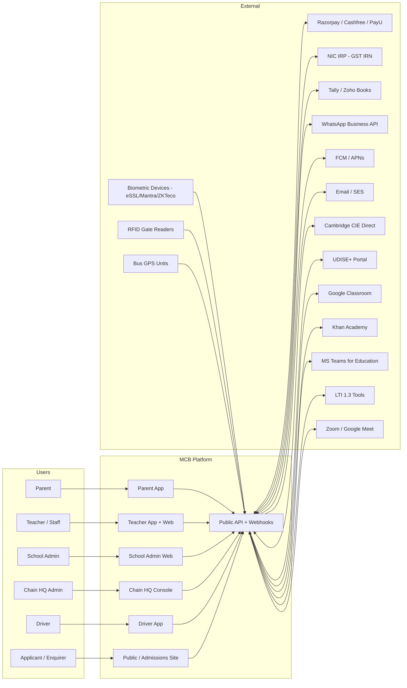

---

## 5. Tenancy Model

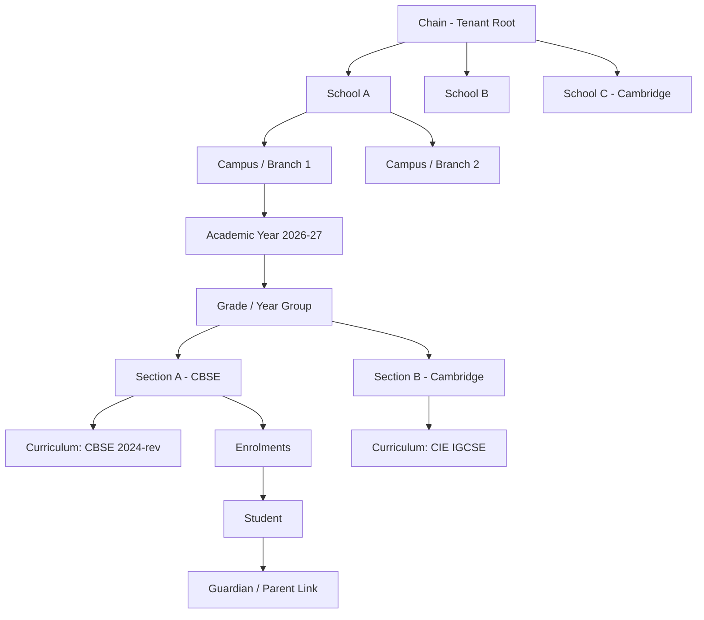

Key rules:
- **Chain** is the billing/contract entity. A chain can hold 1..N schools.
- **School** has a board *default* but a **Section** carries the authoritative `curriculum_id`. This is what unlocks "CBSE in 4A, Cambridge in 4B".
- **Academic Year** is its own entity with start/end and term structure; data is partitioned by AY for clean rollover.
- **Student** is a person; their participation in a section is an **Enrolment** (time-bounded). A student can have multiple historical enrolments.
- **Guardian–Student** is many-to-many with relationship metadata (primary, custodial, payor, communications opt-in flags).
- **Staff** is a person with one or more **StaffRoles** scoped to a school (Class Teacher, Subject Teacher, HOD, Principal, Admin, Counsellor, etc.).
- **RBAC scopes**: action permitted on `(scope_type, scope_id)` — e.g. `mark_attendance` on `section:123`.

---

## 5a. Tenant Data Isolation Model

Each **chain** is the tenancy boundary. The data plane is organised as:

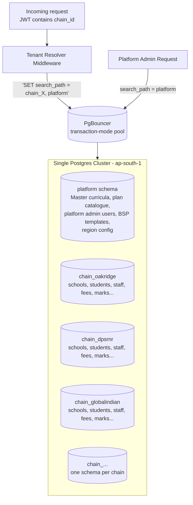

**Why schema-per-chain (not shared schema, not DB-per-chain):**

| Concern | Shared schema + RLS | **Schema-per-chain (chosen)** | DB-per-chain |
|---|---|---|---|
| Blast radius of a missing `WHERE` | All tenants leaked | Bounded to one chain (and RLS still catches it inside) | Bounded to one chain |
| Per-tenant backup/restore | Logical export gymnastics | `pg_dump --schema=chain_X` clean | Trivial |
| DPDP erasure (chain offboards) | Cascading deletes across 60+ tables | `DROP SCHEMA chain_X CASCADE` | Drop database |
| Cross-chain analytics (platform view) | Trivial single query | Union across schemas OR query warehouse | Hard — needs ETL |
| Migration cost | 1× | N× (≈20 at year 1; tooling makes this fine) | N× + N config |
| Connection pool friction | None | `search_path` set per checkout | N pools |
| Sales narrative | "We filter by tenant column" | "Your chain's data is in its own isolated schema" | "Your chain has its own database" |
| Data residency upgrade path | Hard — re-architect | Move schema to a regional cell | Move DB to a regional cluster |

**How it works at runtime:**

1. **JWT carries `chain_id`** (signed; cannot be tampered with). For platform-admin tokens the claim is `platform`.
2. **Tenant Resolver Middleware** runs before every request, validates the claim against the user's allowed chains, and selects the schema.
3. **PgBouncer in transaction-mode** — on each transaction checkout, the app issues `SET LOCAL search_path = chain_oakridge, platform;`. This scopes every query to that chain's schema, with `platform` as fallback for shared tables (curriculum templates, BSP templates, plan catalogue).
4. **Migrations** run through a tenant-aware migrator (e.g., custom Flyway/Liquibase wrapper or schema-aware `sqitch`) that applies every migration to `platform` once and to each `chain_X` schema in parallel. We track schema version per chain.
5. **RLS as defence in depth.** Even within `chain_oakridge`, RLS on `school_id` prevents a teacher at School A from accidentally reading School B's data via a misbuilt query.
6. **Platform-admin queries** that need to see all chains (e.g., subscription billing roll-ups) connect with `search_path = platform` only and query a **read-side data warehouse** populated by per-schema CDC — never by reading directly across chains in OLTP.

**What lives where:**

| In `platform` schema (shared) | In each `chain_X` schema (per-tenant) |
|---|---|
| Master CBSE / Cambridge curriculum templates | School, Campus, Academic Year, Term |
| Subscription plans & feature toggles | Students, Guardians, Staff, Enrolments |
| WhatsApp BSP master template registry | Sections, Subjects, Timetable |
| Region & residency config | Attendance, Marks, Report Cards |
| Platform admin users | Fees, Invoices, Payments, Ledger |
| Domain enumerations (board codes, grade taxonomies) | Library, Transport, Hostel |
| Auth provider configs | Audit log (chain-scoped) |

**Upgrade path to DB-per-chain (Phase 3):**

When a chain crosses thresholds (e.g., >100k students, regulated tenant, or contract demands), we relocate that chain's schema to its own database in its own region. Because the application already scopes by `search_path` and the schema name, the move is a `pg_dump`/`pg_restore` to a new connection string in the chain's tenant config — no code changes.

---

## 6. Container / Service View

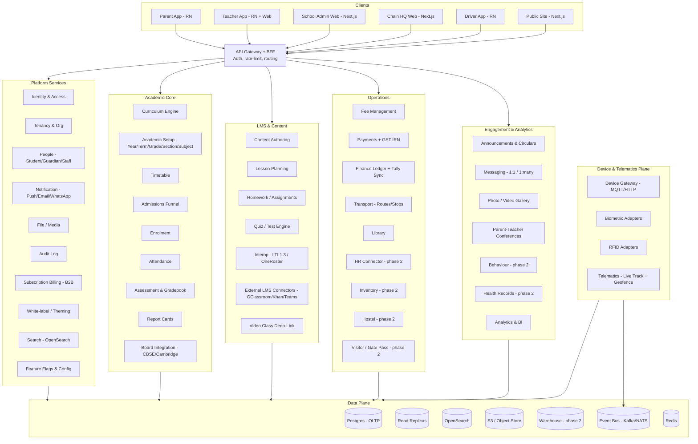

---

## 7. Building Blocks — Ordered for Construction

This is the **build order**. Each layer depends only on layers above it. We can parallelise *within* a layer but not skip ahead.

### Layer 0 — Platform Foundation (weeks 1–8; everything depends on this)

| # | Module | Purpose | MVP? |
|---|---|---|---|
| 0.1 | **Identity & Access (IAM)** | Email/phone+OTP, sessions, JWT, RBAC, scope-based permissions, SCIM-ready | MVP |
| 0.2 | **Tenancy & Org** | Chain, School, Campus, Academic Year, Term, Grade, Section. Tenant context middleware. RLS policies. | MVP |
| 0.3 | **People** | Student, Guardian, Staff. Guardian-Student links. Address, contact, documents. APAAR-ready fields. | MVP |
| 0.4 | **File / Media** | S3-backed, virus scan, image variants, signed URLs, retention policy. | MVP |
| 0.5 | **Notification** | Channel routing (Push/Email/WhatsApp), template engine with i18n, opt-in/out, WhatsApp 24-hr session + template approval flow, delivery receipts. | MVP |
| 0.6 | **Audit Log** | Append-only, queryable, exportable. Required for DPDP. | MVP |
| 0.7 | **Feature Flags & Config** | Per-tenant toggles, gradual rollouts, A/B. | MVP |
| 0.8 | **White-label / Theming** | Per-school logo, palette, app name, splash, custom domain, email-from, push sender ID. | MVP |
| 0.9 | **Search** | OpenSearch with per-tenant index aliases. Used by Students, Library, Content. | MVP |
| 0.10 | **Event Bus + Outbox** | Postgres outbox → Kafka/NATS. Domain events as the inter-module contract. | MVP |
| 0.11 | **Background Jobs** | Scheduled + retryable. Powers report generation, board exports, reminders. | MVP |
| 0.12 | **Subscription Billing (B2B)** | Per-school plan, usage metering (active students, WhatsApp messages, storage). | Phase 2 |

### Layer 1 — Academic Core (weeks 6–20; the heart of the product)

| # | Module | Purpose | MVP? |
|---|---|---|---|
| 1.1 | **Academic Setup** | Year/Term, Grade/YearGroup, Subject, Section, Section-Subject-Teacher mapping. | MVP |
| 1.2 | **Curriculum Engine** | Curriculum = versioned tree: Strand → Unit → Topic → Learning Outcome. Per-board strategies. CBSE NCF-aligned templates; Cambridge syllabus codes (e.g. 0580 IGCSE Maths). | MVP |
| 1.3 | **Admissions Funnel** | Public enquiry form → Application portal → Document upload → Entrance test/interview scheduling → Merit/lottery → Offer letter → Application fee → Seat confirmation → Auto-enrolment. | MVP |
| 1.4 | **Enrolment** | Student enrolment in section, with history. Transfer cert, withdrawal, promotion engine. | MVP |
| 1.5 | **Attendance** | Daily + period-wise. Sources: manual (teacher), biometric (staff + senior), RFID gate. Status taxonomy (Present, Absent, Late, Leave, Excused). Auto-notify parents on absence. | MVP |
| 1.6 | **Timetable** | Per-section weekly schedule, period-subject-teacher-room, clash detection. Substitute teacher allocation. | MVP |
| 1.7 | **Assessment & Gradebook** | Per-curriculum-strategy. CBSE: PT/HY/Annual + co-scholastic descriptors. Cambridge: components, syllabus codes, coursework weights, A*–E / 9–1 grade scales. Rubrics. Moderation workflow. | MVP |
| 1.8 | **Report Cards** | Board-styled templates. Auto-generated, lock/unlock, parent visibility window. Bulk PDF + per-student. | MVP |
| 1.9 | **Board Integration** | Outbound adapter framework. CBSE: UDISE+ XML export, Pariksha Sangam mapping. Cambridge: CIE Direct candidate registration, syllabus entries, statement-of-entry retrieval. | MVP |
| 1.10 | **Promotion / Year-End Rollover** | Auto-promote with overrides, archive old enrolments, carry over student records. | Phase 2 |

### Layer 2 — Communications & Engagement (weeks 12–22)

| # | Module | Purpose | MVP? |
|---|---|---|---|
| 2.1 | **Announcements & Circulars** | School-wide, grade-wide, section-wide. Attachments. Read receipts. Multi-channel fan-out. | MVP |
| 2.2 | **Messaging** | Teacher↔Parent 1:1 (audited), Section broadcast (one-way), Group threads (phase 2). | MVP |
| 2.3 | **PTM Scheduling** | Slot booking, parent self-serve, teacher availability, video link auto-gen. | Phase 2 |
| 2.4 | **Photo/Video Gallery** | Class-event uploads, consent-aware. Per-student tagging (with face-blur option for non-consenting children). | Phase 2 |
| 2.5 | **Behaviour & Discipline** | Points, citations, parent visibility, intervention workflow. Cambridge house-system support. | Phase 2 |

### Layer 3 — LMS & Content (weeks 14–26)

| # | Module | Purpose | MVP? |
|---|---|---|---|
| 3.1 | **Content Authoring** | Rich content blocks (text, image, video, embed, file, math). Reusable libraries scoped to school + chain. | MVP |
| 3.2 | **Lesson Planning** | Plans tied to Curriculum nodes. Cambridge "Scheme of Work" alignment with syllabus codes. CBSE NCERT learning outcome mapping. Templates per board. | MVP |
| 3.3 | **Homework & Assignments** | Create, assign to section, due date, submission types (file/text/quiz). Grading workflow with rubrics. | MVP |
| 3.4 | **Quiz / Test Engine** | MCQ, multi-select, short, long, match, fill, file-upload. Question bank with per-curriculum tagging. Auto-grade + manual override. Test sessions with timing, lockdown, randomisation. | MVP |
| 3.5 | **Interop — LTI 1.3** | LTI Advantage: Deep Linking, Names & Roles, Assignment & Grade Services. Lets us embed Khan Academy, MathSpace, Read Theory, etc. as graded activities. | MVP |
| 3.6 | **Interop — OneRoster 1.2** | Roster, gradebook, demographics sync. Outbound to Google Classroom / MS Teams Edu / Canvas. | MVP |
| 3.7 | **External LMS Connectors** | Direct: Google Classroom API (roster/assignments/grades bidi sync), Khan Academy school accounts (mastery progress import), MS Teams Education Graph. Wrapped over OneRoster/LTI where possible. | MVP |
| 3.8 | **Video Class Deep-Link** | Zoom / Google Meet / Teams meeting creation + roster invite. Recording link capture. No native video. | MVP |

### Layer 4 — Operations (weeks 16–28)

| # | Module | Purpose | MVP? |
|---|---|---|---|
| 4.1 | **Fee Management** | Fee heads (Tuition, Lab, Transport, Library, Exam, etc.), structures per Grade × AY, sibling discount rules, scholarship workflow, late-fee policy. | MVP |
| 4.2 | **Payments** | Razorpay/Cashfree/PayU multi-gateway abstraction, hosted checkout + UPI intent, retry/reconciliation, refund with approval, partial payments, installment plans. | MVP |
| 4.3 | **GST e-Invoice** | NIC IRP integration for IRN generation, QR codes, e-invoice cancellation. State-wise GSTIN per school. | MVP |
| 4.4 | **Finance Ledger** | Double-entry shadow ledger (accounts: Fee Receivable, Fee Income, Discount, Bank, etc.). Daily journal. | MVP |
| 4.5 | **Tally / Zoho Books Sync** | Tally TallyPrime Connector via TDL + ODBC; Zoho Books REST. Configurable mapping. | MVP |
| 4.6 | **Transport** | Routes, stops, vehicles, drivers, student-stop assignment. Fee linkage to Transport head. | MVP |
| 4.7 | **Telematics & Live Tracking** | Ingest GPS pings, store traces, parent live-map (3-min refresh), ETA at next stop, geofence enter/exit alerts to parent + school. | MVP |
| 4.8 | **Library** | Catalogue (ISBN scan, MARC import optional), copies, members, issue/return, fines, reservations. | MVP |
| 4.9 | **HR Connector** *(not a built module)* | Read-only sync of staff records, leave balances, and attendance with external HRIS (Keka, Zoho People, greytHR, Darwinbox). One-way push of attendance from our system to HRIS; pull of staff/leave from HRIS. **No payroll built in-house.** | Phase 2 |
| 4.10 | **Hostel** | Rooms, allocation, mess, in/out leave, hostel attendance. | Phase 2 |
| 4.11 | **Visitor / Gate Pass** | Visitor registration, pre-authorised pickups, delegated guardian pickup with OTP. | Phase 2 |
| 4.12 | **Inventory & Procurement** | Asset register, consumables, requisition → PO → GRN. | Phase 3 |

### Layer 5 — Hardware / IoT Plane (weeks 18–26; parallel to Layer 4)

| # | Module | Purpose | MVP? |
|---|---|---|---|
| 5.1 | **Device Gateway** | Auth, registration, command channel (MQTT for GPS, HTTP for biometric/RFID), heartbeat, OTA hooks. | MVP |
| 5.2 | **Biometric Adapter** | SDK wrappers for eSSL, Mantra, ZKTeco. Local agent pattern at school server. Pull-and-push fallback. Maps to Staff/Student via card/fingerprint ID. | MVP |
| 5.3 | **RFID Reader Adapter** | Gate readers post events to gateway. Resolves card → student → triggers attendance event + parent push. | MVP |
| 5.4 | **GPS Telematics Adapter** | MQTT broker (EMQX/HiveMQ), parser for Teltonika / Concox / generic NMEA. Stores in time-series store (Timescale partition or InfluxDB). | MVP |
| 5.5 | **Geofencing Engine** | Per-stop geofence, school geofence. Enter/exit → events → notifications. | MVP |
| 5.6 | **Device Provisioning Console** | Per-school admin UI to register devices, assign to bus/gate, see liveness. | MVP |

### Layer 6 — Analytics & Insights (weeks 24–32)

| # | Module | Purpose | MVP? |
|---|---|---|---|
| 6.1 | **Operational Dashboards** | School admin daily-ops view (attendance %, fee collection %, comms reach). | MVP-lite |
| 6.2 | **Chain HQ Dashboards** | Cross-school KPIs (enrolment, fees, attendance trends). | Phase 2 |
| 6.3 | **Academic Analytics** | Student progress vs curriculum outcomes, cohort comparisons, at-risk flags. | Phase 2 |
| 6.4 | **Data Warehouse + BI** | CDC from OLTP → warehouse; metabase/superset for self-serve. | Phase 2 |

### Layer 7 — Platform & Extension (continuous)

| # | Module | Purpose | MVP? |
|---|---|---|---|
| 7.1 | **Public REST + GraphQL API** | Documented, versioned, token-auth. | MVP |
| 7.2 | **Webhooks** | Outbound, signed (HMAC), retry-with-backoff, replay. | Phase 2 |
| 7.3 | **Marketplace / Plugin SDK** | Third-party integrations register via OAuth + scopes. | Phase 3 |
| 7.4 | **Public Site Builder / Admissions Microsite** | Per-school marketing pages + applicant flow. | MVP |

---

## 8. Domain Model (selected core)

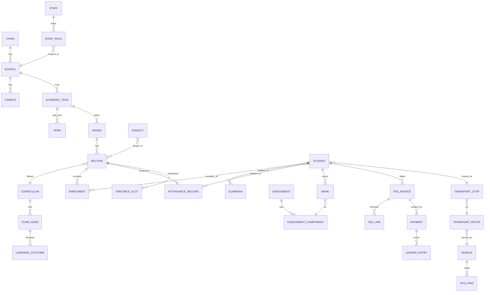

Notes that matter:
- **MARK** is on an **ASSESSMENT_COMPONENT**, which belongs to an **ASSESSMENT**, which is owned by a **Curriculum strategy**. CBSE's "Periodic Test 1" and Cambridge's "Paper 2 Component" are both `AssessmentComponent` rows with different `strategy_data` JSON shapes. No shared "marks" superschema.
- **LEDGER_ENTRY** is the double-entry shadow record. Every payment, refund, discount writes balanced debits/credits.

---

## 9. Curriculum Engine — Deep Dive

This is the riskiest subsystem. If we get it wrong, CBSE feels OK and Cambridge feels broken, or vice versa.

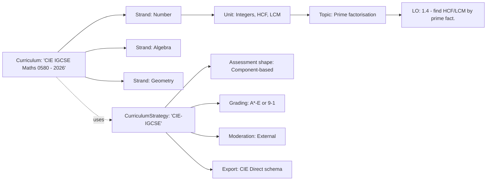

A different strategy plugs in for CBSE:

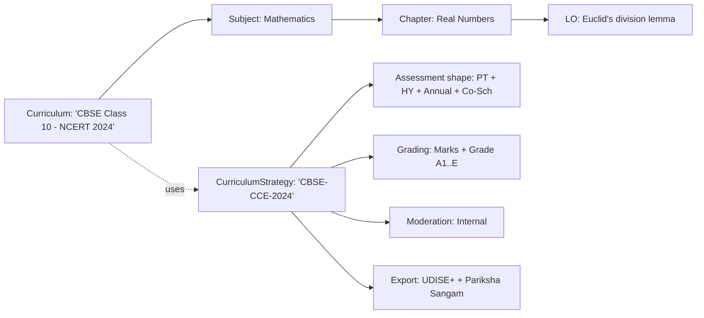

What stays generic: the **tree structure** (Curriculum → Node → LearningOutcome), the **section-binding**, the **lesson-plan attachment** to nodes, the **content tagging** to nodes.

What is strategy-specific: **assessment shapes**, **grading scales**, **report-card templates**, **external-export adapters**.

---

## 10. Notification Service — WhatsApp First

WhatsApp Business API is not a drop-in for SMS. Three things break naive designs:

1. **Template approval.** Outside the 24-hour user-initiated session, every message must be a Meta-approved template. We model `MessageTemplate` with status (draft, submitted, approved, paused) and BSP (Business Solution Provider) sync.
2. **Session windows.** Within 24h of last user-initiated inbound, free-form replies allowed. Track per-conversation last-inbound timestamp.
3. **Opt-in tracking.** WhatsApp policy + DPDP both require provable opt-in. We capture opt-in source + timestamp.

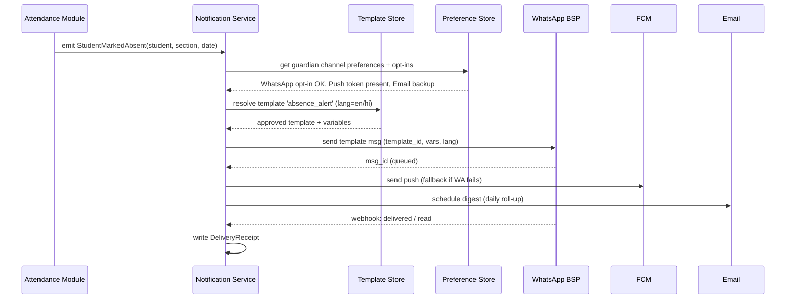

---

## 11. Hardware/IoT Plane — Deep Dive

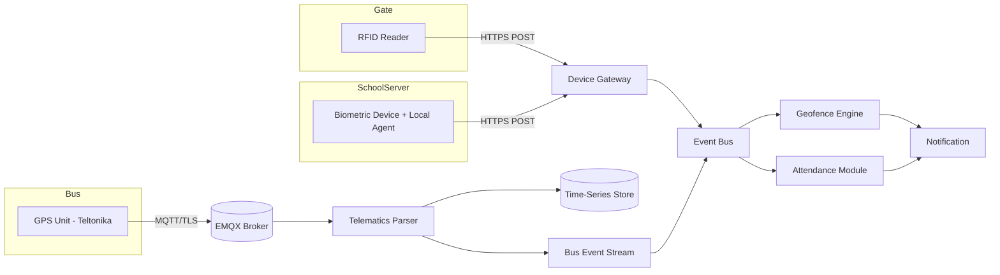

Why a **local agent** at the school for biometrics: most popular Indian biometric devices (eSSL, Mantra, ZKTeco) speak proprietary SDKs over LAN, not direct cloud HTTP. We ship a thin Windows/Linux agent that bridges device SDK ↔ our HTTPS endpoint. This also handles intermittent school internet.

---

## 12. External LMS & Content Interop

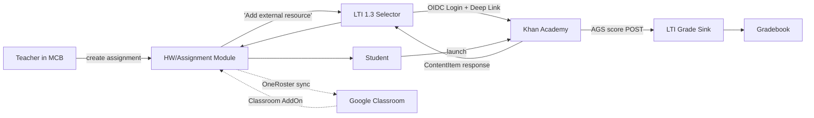

**LTI 1.3 (Deep Linking + AGS + NRPS)** is the unlock. Once a teacher links Khan Academy or any LTI tool once at the school level, every section gets a "Add LTI activity" button. Grades flow back automatically.

**OneRoster 1.2** lets us be the system-of-record for rosters and let Google Classroom / MS Teams Edu pull, while pushing assignment grades back into our gradebook.

**Direct connectors** (Google Classroom REST, Khan partner) are kept as fallbacks where standards are weak or proprietary features matter (e.g., Khan mastery progress import).

---

## 13. Admissions Funnel

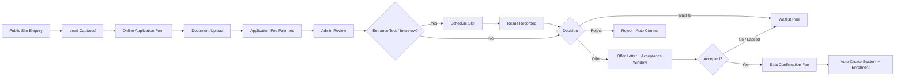

Each step is a state in a state machine; transitions emit events; each event can trigger comms (WhatsApp template, Email).

---

## 14. Fee Payment — End-to-End

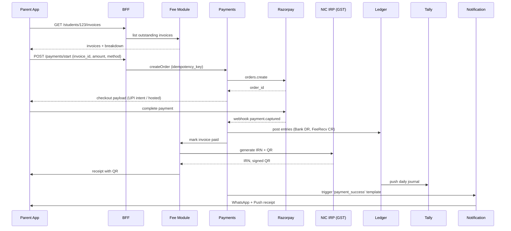

---

## 15. User Surfaces — What Each Does

### Parent App (React Native, iOS + Android)
- **Home**: today's snapshot — attendance, next-period subject, fee due, latest announcements.
- **Children switcher**: parents with multiple kids switch at the top.
- **Attendance**: month view, drill-down, leave application.
- **Fees**: invoices, pay now (UPI/Card/NetBanking), past receipts (with GST IRN QR).
- **Report Cards**: download PDFs, in-app preview.
- **Homework & Assignments**: read-only view of what's assigned, submit if student-on-parent-device flow.
- **Messages**: 1:1 with class teacher, broadcasts from school.
- **Bus Tracking** (transport users): live map, ETA at stop, today's bus status.
- **PTM**: book a slot (phase 2).
- **Gallery** (phase 2): consent-aware class photos.
- **Notices/Circulars**: searchable archive.
- **Profile & Settings**: contact info, channel preferences (WhatsApp opt-in toggles per topic).

### Teacher / Staff App (React Native + Web companion)
- **My Day**: today's timetable, quick mark attendance, pending grading.
- **Attendance**: mark by section + period, bulk edits.
- **Gradebook**: enter marks per assessment component, save draft, submit for moderation.
- **Lesson Plans**: view, edit, attach content/resources to curriculum nodes.
- **Homework/Assignments**: create, distribute, grade.
- **Messaging**: chat with parents (audit-logged), section broadcasts.
- **Reports**: my-section dashboards, at-risk students.
- **Substitute Today**: claim or get assigned.
- **Staff Self-Service**: leave application, payslips (read), attendance.

### School Admin Web Console (Next.js)
- **Dashboard**: attendance %, fee collection % MTD, admissions funnel, comms reach.
- **Academic Setup**: years, terms, grades, sections, subjects, curriculum binding.
- **Admissions**: pipeline kanban, applicant detail, document review, decisions.
- **Students & Guardians**: full CRUD, search, bulk import.
- **Staff & Roles**: HR, RBAC scope assignment.
- **Attendance Ops**: corrections, leave approvals, biometric mappings.
- **Fees**: structures, invoices, payments, reconciliation, refunds, Tally sync status.
- **Timetable Editor**: drag-drop with clash detection.
- **Library, Transport, Hostel**: full operational consoles.
- **Comms Studio**: announcements, template management, scheduled broadcasts.
- **Reports & Exports**: report cards, UDISE+ export, CIE entries.
- **Branding**: white-label theme editor, custom domain, app icons.
- **Integrations**: Google Classroom / Tally / payment gateway config.

### Chain HQ Console (Next.js)
- **Multi-school dashboard**: KPIs across schools (enrolment trend, fee health, attendance, comms).
- **Policy & Templates**: chain-wide curricula, fee policies, message templates pushed down.
- **Centralised Reporting**: roll-ups, exportable.
- **Tenant & Plan Management**: school onboarding, plan tiers.
- **Identity Governance**: SSO config, staff RBAC defaults.

### Driver App (React Native)
- **Today's Trip**: assigned vehicle, route, stop list, manifest.
- **Trip Start / End**: explicit start triggers live-tracking to parents.
- **Stop Check-in**: tap arrived/departed; auto-record from geofence as backup.
- **Incident Reporting**: report breakdown or detour.

### Public Site / Admissions Microsite (per school)
- Static-rendered, white-labelled per school. Enquiry form, application portal, fee payment, document upload.

---

## 16. Non-Functional Requirements

### Security
- **AuthN**: OTP-based for parents (phone) and teachers/staff (email). Session JWTs (15 min) + refresh tokens (rotated). MFA for admin roles. Future: SSO (Google Workspace, M365).
- **AuthZ**: RBAC with scopes (action × resource × scope). **Schema-per-chain isolates tenants at the data plane**; RLS on `school_id` inside each chain schema is the second line of defence. Application code never builds a query that crosses chain schemas — cross-chain reporting goes through the warehouse only.
- **PII encryption**: field-level KMS-backed encryption for Aadhaar, contact numbers, addresses, medical fields.
- **Audit log**: every state change with actor, before/after, IP, user-agent.
- **DPDP Act**: consent registry per data subject (student + parent), data-subject-request (DSR) workflow (access, correction, erasure), retention policy per entity.
- **Children's data**: parental consent flow for under-18; photo/video gallery has explicit consent toggle per child.
- **Secrets**: vaulted (Doppler / AWS Secrets Manager); never in repo.

### Performance & Scale (year-1 target)
- 50k students, 5k concurrent users at peak (start-of-day attendance + fee-due-date evening).
- p95 read < 200ms, p95 write < 500ms.
- Background work (report generation, board exports) on dedicated worker pool with priority queues.
- Read replicas for analytics queries. CQRS-lite: write-side normalised, read-side denormalised projections for hot dashboards.

### Reliability
- Multi-AZ deploy. RPO 5 min, RTO 1 hour.
- Outbox pattern for inter-module events; idempotent consumers.
- Circuit breakers around all external integrations (CIE Direct, IRP, BSP, Tally).

### Observability
- Structured logs (JSON), distributed tracing (OpenTelemetry), metrics (Prometheus), error tracking (Sentry).
- Per-tenant dashboards for ops.

### Compliance
- **DPDP Act 2023** (India): consent, purpose limitation, data fiduciary obligations. **Chain offboarding = `DROP SCHEMA chain_X CASCADE`** plus object-store prefix purge — clean, auditable, irreversible.
- **GDPR / UK DPA** (Cambridge international schools): map to same controls.
- **CBSE bye-laws**: prescribed record retention.
- **GST**: e-invoice IRN for invoices ≥ ₹5 cr aggregate turnover or per future thresholds.
- **Data residency**: primary in `ap-south-1` (Mumbai). Backup snapshot encrypted; configurable region override for international tenants.

---

## 17. Technology Recommendations

| Layer | Choice | Why |
|---|---|---|
| **Backend** | Node.js + TypeScript (NestJS) or Kotlin + Spring Boot | Strong typing, mature ecosystem, plenty of Indian hiring. Pick one and commit. |
| **API** | REST (public + BFF) + GraphQL (internal app↔BFF) | REST for stability; GraphQL where mobile screens compose many resources. |
| **DB** | Postgres 16 + read replicas | **Schema-per-chain** + shared `platform` schema. RLS inside each schema for `school_id`. JSONB for strategy-specific shapes. Partitioning by Academic Year inside large tables. |
| **DB migrations** | Tenant-aware runner (custom Flyway wrapper or `sqitch`) | Applies each migration to `platform` once and to every `chain_X` schema in parallel. Per-schema version tracking. |
| **Connection pool** | PgBouncer in transaction mode | `SET LOCAL search_path` per transaction checkout. Sized to N chains × M connections. |
| **Search** | OpenSearch | Per-tenant index aliases |
| **Object Store** | S3 (or Wasabi for cost) | Files, media, report PDFs |
| **Time Series** | TimescaleDB (Postgres extension) | GPS pings — keeps stack simple |
| **Event Bus** | Kafka (managed: Aiven/Redpanda Cloud) or NATS JetStream | Outbox → bus → consumers |
| **MQTT** | EMQX or HiveMQ | GPS telemetry |
| **Cache / Sessions** | Redis | |
| **Web** | Next.js (App Router) | School admin, HQ console, public site |
| **Mobile** | React Native + Expo | One codebase, fast OTA updates via EAS |
| **Auth** | Self-hosted (Ory Kratos/Hydra) or Auth0/Clerk | Self-host once we hit 50k+ users for cost |
| **Background jobs** | Temporal or BullMQ | Temporal for long-running (admissions, board exports); BullMQ for short |
| **Payments** | Razorpay primary; Cashfree fallback | UPI-first, decent docs |
| **GST IRN** | ClearTax/Masters India IRP gateway | Avoid wiring NIC IRP directly |
| **WhatsApp BSP** | Gupshup / AiSensy / Wati | India-focused, template tooling |
| **Email** | AWS SES | Cost; SPF/DKIM domain-per-tenant |
| **Tally sync** | TallyConnector + custom TDL OR Tally Cloud Connect | School-side connector |
| **Hosting** | AWS Mumbai (`ap-south-1`) | Data residency |
| **Container** | Docker + ECS Fargate (start) → EKS (scale) | Skip K8s on day one |
| **Infra-as-code** | Terraform + Atlantis | |
| **CI/CD** | GitHub Actions | |
| **Observability** | OTel + Grafana Cloud / Datadog | |

---

## 18. Build Order — Dependency Graph

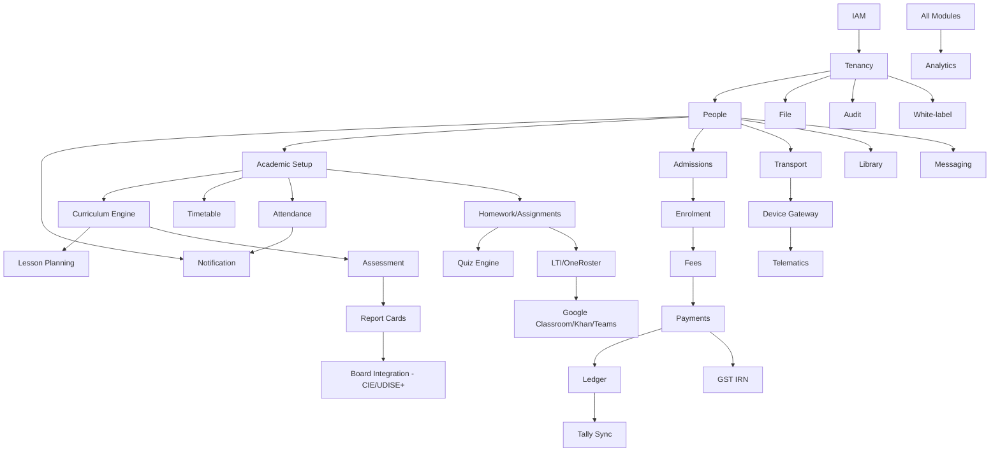

---

## 19. MVP vs Phase 2 vs Phase 3

### MVP (months 0–9 with a team of ~12–15 engineers)

**Platform foundation** (IAM, Tenancy, People, File, Notification, Audit, Theming, Search, Event bus, Jobs)

**Academic core** (Setup, Curriculum, Admissions full funnel, Enrolment, Attendance, Timetable, Assessment, Report Cards, **Board Integration: CIE Direct + UDISE+**)

**LMS** (Content, Lesson Plans, Homework, Quiz Engine, **LTI 1.3 + OneRoster + Google Classroom + Khan Academy + MS Teams Edu connectors**, Video deep-link)

**Operations** (Fees + GST IRN + Tally sync, Payments, Ledger, Transport, **Library**)
*HR & Payroll is **not** built in-house — schools keep using Keka / Zoho People / greytHR; we ship a connector in Phase 2.*

**Hardware** (Device Gateway, Biometric, RFID, GPS telematics, Geofencing, Provisioning console)

**Engagement** (Announcements, Messaging)

**Surfaces** (Parent app, Teacher app + web, School admin web, Chain HQ basic dashboard, Driver app, Public/admissions microsite)

**Comms** (Push + Email + WhatsApp)

> ⚠️ This MVP is still large. If we need to cut further, the safest cuts are: Library (manual + simple catalog), Quiz Engine (start with file-upload assignments only), Chain HQ dashboard (defer to Phase 2). Cambridge Board Integration and WhatsApp are *not* cuttable — they're the wedge.

### Phase 2 (months 9–18)

- Promotion / year-end rollover engine
- **HR Connector to Keka / Zoho People / greytHR / Darwinbox** (staff sync, leave, attendance push)
- PTM scheduling
- Photo/Video gallery (with consent flow)
- Behaviour & Discipline (house system, points)
- Health records
- Hostel management
- Visitor / gate pass
- SMS as a channel
- Chain HQ analytics + warehouse
- Academic analytics & at-risk flags
- Google Workspace + M365 SSO
- DigiLocker doc verification at admissions
- Webhooks (outbound)
- B2B subscription billing module
- Substitute teacher auto-allocation
- IB / Edexcel / State boards (CISCE, IB) via new curriculum strategies

### Phase 3 (months 18+)

- Marketplace / plugin SDK
- Inventory & procurement
- Cafeteria + student wallet
- Alumni & advancement
- Career counselling / college applications
- Surveys & feedback engine
- Native live classes (LiveKit) — only if external video proves a real friction
- Multi-region cell deployment (move a chain's schema into a region-local cluster)
- DB-per-chain upgrade path for enterprise / regulated chains (schema relocates into its own database with no code changes — connection string is the only thing that changes)
- AI tutoring layer (content-anchored, curriculum-aware)
- Voice/IVR channel

---

## 20. Risks & Open Questions

| # | Risk / Open Q | Why it matters | Suggested resolution |
|---|---|---|---|
| R1 | Cambridge CIE Direct API maturity varies by region and centre | Could become a blocker for any Cambridge school we onboard | Pilot with 2 friendly Cambridge schools early; build a CSV-export fallback |
| R2 | Tally integration is fragile — every school has a different chart of accounts | Sync errors will land on us | Build a mapping wizard + dry-run mode; default to Zoho Books which has stable REST |
| R3 | WhatsApp template approval timeline is 24–72h and not deterministic | Onboarding latency | Ship a SMS-fallback toggle even though SMS isn't MVP |
| R4 | Biometric SDKs are Windows-only for many devices | Schools running Mac/Chromebooks fail | Mandate a small Windows / Linux on-prem agent; document hardware list |
| R5 | DPDP Act rules are still evolving | Compliance moving target | Build a consent registry that can absorb new consent dimensions; appoint a DPO from year 1 |
| R6 | Curriculum engine over-engineering | Risk of building a CMS no one uses | Start with seeded CBSE + CIE curricula; let schools edit, not author from scratch |
| R7 | Year-1 modular monolith vs services tension | Wrong choice slows year 2 | Enforce module boundaries via package-private + DB-schema-per-module from day one |
| R8 | Hardware vendor lock-in (eSSL etc.) | Bad SDKs leak into our core | Adapter pattern + per-device-class interface; no device specifics outside `hardware/` |
| R9 | Year-end rollover (promotion) | One bug erases history for thousands of students | Make rollover idempotent + reversible (event-sourced); pilot with 1 school first |
| R10 | Multi-board report card templating | Schools want endless visual tweaks | Use a templating engine (Handlebars/Jinja) + theme overrides; resist per-school custom code |
| R11 | Schema-per-chain migration drift | A failed migration on one chain's schema (e.g., disk full, lock timeout) leaves chains on different schema versions | Per-schema version tracking, transactional migrations, alerting on drift, ability to retry per-schema. CI runs migrations against N synthetic chain schemas to catch issues pre-prod. |
| R12 | Cross-chain analytics rebuilt out of OLTP | Platform admin and HQ-of-HQ views can't simply `SELECT ... FROM all_chains` | Mandatory: build the warehouse early (Phase 2). For MVP platform admin views, accept a small fan-out query helper that loops schemas with a hard tenant cap. |
| R13 | PgBouncer + `SET search_path` gotchas | Transaction-mode pooling + session state is a known footgun; a `RESET` mid-transaction can leak schema | Always use `SET LOCAL` (transaction-scoped), never `SET`. Add a connection-acquire hook that verifies `current_schema()` matches the resolved chain before the first query. |

---

## 21. Module Build Order — At a Glance

1. **IAM → Tenancy → People → File → Notification → Audit → Theming → Event Bus → Jobs**
   *(Without these, nothing else can be built safely.)*
2. **Academic Setup → Curriculum Engine** *(seed CBSE + Cambridge templates)*
3. **Admissions → Enrolment** *(now you can put students into sections)*
4. **Attendance → Timetable** *(daily school life)*
5. **Fees → Payments → Ledger → GST IRN → Tally Sync** *(the chain will sign the cheque the day this works)*
6. **Assessment → Report Cards → Board Integration** *(the academic differentiator)*
7. **LMS: Content → Lesson Plans → Homework → Quiz → LTI/OneRoster → External Connectors** *(the engagement loop for teachers + students)*
8. **Comms: Announcements → Messaging** *(reaches parents daily)*
9. **Transport + Device Gateway + Telematics + Biometric + RFID** *(hardware plane)*
10. **Library** *(round out operations)*
11. **Dashboards (School + HQ)** *(prove value to buyers)*

*HR & Payroll is intentionally out of MVP scope. Schools continue to use their existing HRIS (Keka, Zoho People, greytHR, Darwinbox). We ship an outbound staff-attendance push + inbound staff-record pull connector in Phase 2.*

---

## 22. Closing Argument

The thesis is that the school-tech market in India has many broad-but-shallow ERPs, a few deep but US-shaped systems, and almost no platform that treats **Cambridge with the same first-class respect as CBSE**, **WhatsApp as the comms primary**, and **interop (LTI/OneRoster) as table stakes**. We are building that platform. Everything in this doc — the section-level curriculum, the strategy-per-board assessment, the WhatsApp template lifecycle, the device gateway, the standards-first LMS interop — exists to defend that thesis.

The next deliverable should be a **PRD per MVP module** with user stories and acceptance criteria. I can produce those on request.
